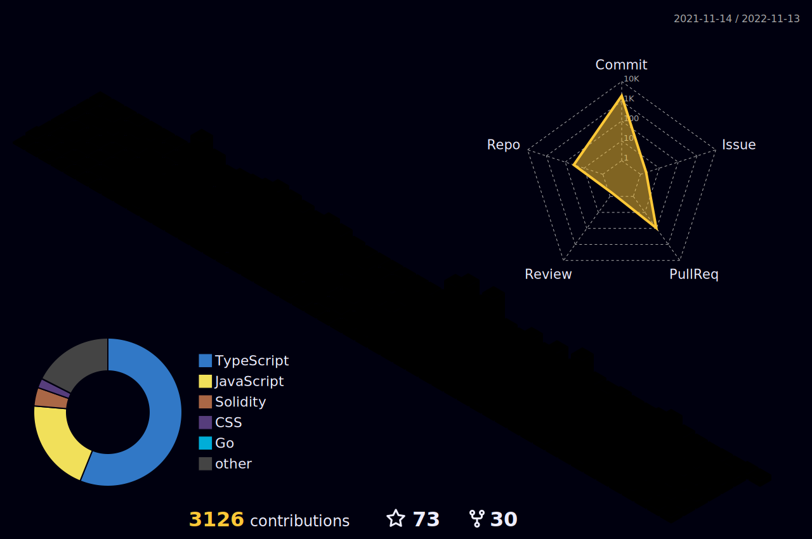

  

<h2 align="left" id="macropower-tech">Favorite Tech</h2>

<table align="center">
  <tr>
    <td align="center" width="96">
        
       React
    </td>
    <td align="center" width="96">
      
       Python
    </td>
    <td align="center" width="96">
        
       JavaScript
    </td>
    <td align="center" width="96">
        
       C++
    </td>
    <td align="center" width="96">
        
       Webpack
    </td>
    <td align="center" width="96">
        
       MySQL
    </td>
    <td align="center" width="96">
        
       TypeScript
    </td>
    <td align="center" width="96">
        
       AWS
    </td>
    <td align="center" width="96">
        
       C#
    </td>
  </tr>
  <tr>
  <td align="center" width="96">
        
       Django
    <td align="center" width="96">
        
       Github
    </td>
    <td align="center" width="96"> 
        
       Git
    </td>
    <td align="center"  width="96">
        
       Laravel
    </td>
    <td align="center"  width="96">
        
       HTML5
    </td>
    <td align="center" width="96">
        
       CSS
    </td>
    <td align="center"  width="96">
        
       Bootstrap
    </td>
    <td align="center" width="96">
        
       Tailwind
    </td>
    <td align="center" width="96">
        
       jQuery
    </td>
  </tr>
 <tr>
      <td align="center" width="96">
        
       MongoDB
    </td>
        <td align="center" width="96">
        
       Nodejs
      </td>
      </td>
    <td align="center" width="96">
        
       PHP
    </td>
              <td align="center" width="96">
        
       WordPress
    </td>
              <td align="center" width="96">
        
       Vue
    </td>
              <td align="center" width="96">
        
       Sass
    </td>
              <td align="center" width="96">
        
       GraphQL
    </td>
    <td align="center" width="96">
        
       PostgreSQL
    </td>
 </tr>
</table>

<h2 align="left" id="macropower-tech">Github Metrics</h2>

 

    

<h2 align="left" id="macropower-tech">Github Status</h2>

 

> GitHub Profile Status

    
    

 

> GitHub Activity Graph

<!-- https://github.com/ashutosh00710/github-readme-activity-graph -->

 

> GitHub 3D Contributors

 

  
  
  

